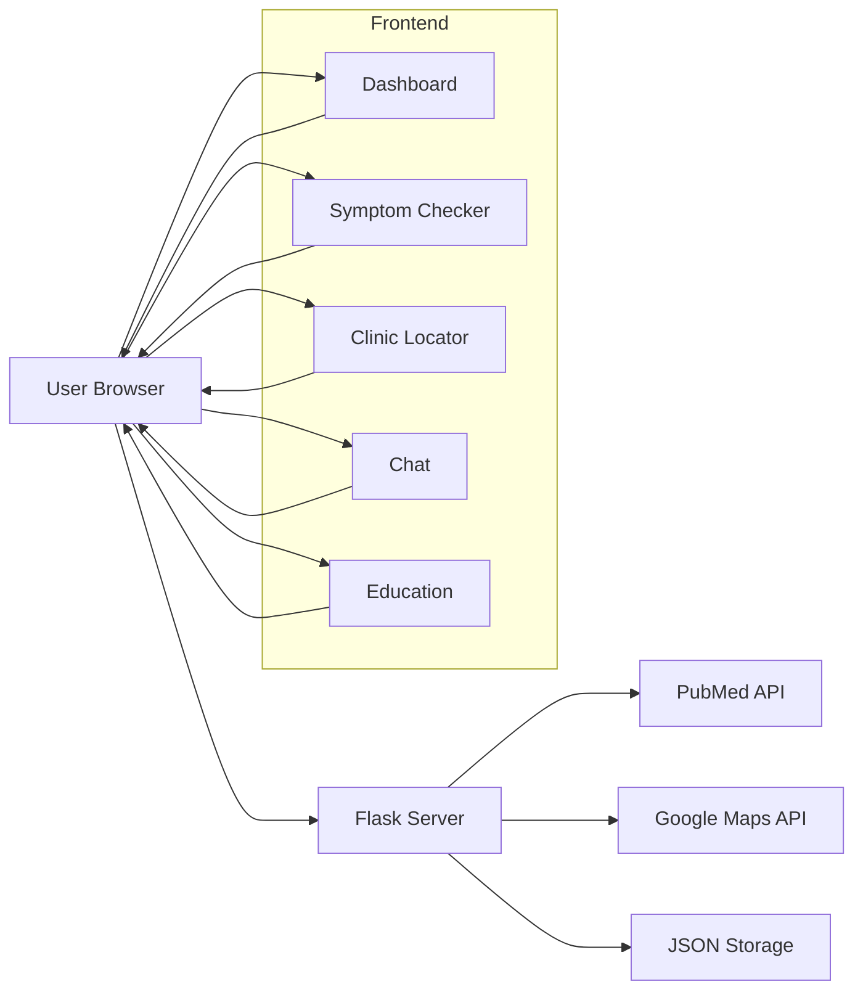

# PCOS Kenya - Women's Health Information Platform

## Table of Contents

1. [Project Overview](#project-overview)
2. [Problem Being Solved](#problem-being-solved)
3. [System Architecture](#system-architecture)
4. [Key Features](#key-features)
5. [Integration Points](#integration-points)
6. [User Flow](#user-flow)
7. [Simple System Diagram](#simple-system-diagram)
8. [Contributing](#contributing)
9. [License](#license)
10. [Contact](#contact)

---

## Project Overview

PCOS Kenya is a **digital health platform** built with **Flask (Python)** that addresses the **information gap on Polycystic Ovary Syndrome (PCOS)** among women in Kenya. It bridges **medical research, healthcare resources, and community support** into a single platform.

---

## Problem Being Solved

* **Limited Access**: Few gynecologists available relative to demand.
* **Cultural Stigma**: Reproductive health is rarely discussed openly.
* **Medical Jargon**: Hard to interpret research.
* **Geographic Barriers**: Rural women lack reliable information.
* **Mental Health**: PCOS causes anxiety, isolation, and confusion.

---

## System Architecture

The application is structured into:

* **Frontend (Client)**: Dashboard, Symptom Checker, Clinic Locator, Chat, Educational content.
* **Backend (Server)**: Flask handles APIs, authentication, geocoding, scraping, and article updates.
* **Data Sources**: PubMed API, Google Maps API, Kenyan healthcare data, validated medical content.
* **Storage**: JSON files for lightweight persistence.

---

## Key Features

* **Dual Interface**: Web (UI) + Console (low-bandwidth).
* **Symptom Checker**: Self-assessment tool with recommendations.
* **Clinic Locator**: Maps + location-based search.
* **Community Chat**: Real-time support.
* **Educational Content**: Localized and simplified resources.
* **Caching & Reliability**: Cached data, error handling, user-friendly fallback.

---

## Integration Points

* **PubMed API**: Research article updates.
* **Google Maps API**: Geocoding & healthcare facilities.
* **Web Scraping**: Valid, accessible medical content.

---

## User Flow

1. User opens dashboard → sees overview.
2. Optional login → personalized features.
3. Explore research + educational content.
4. Use **Symptom Checker** → get recommendations.
5. Search for nearby clinics/hospitals.
6. Chat with community for support.
7. Receive regular updates on PCOS.

---

## Simple System Diagram

---

## Contributing

I welcome contributions to make **PCOS Kenya** better:

1. Fork the repository to create your own copy.
2. Create a new branch for your changes.
3. Commit your updates with a descriptive message.
4. Push your branch and open a Pull Request for review.

---
## Deployment

Firebase

---

## License

This project is released under the **MIT License**.

---

## Contact

For questions, feedback, or collaboration opportunities, please reach out via:

* **Email**: (nasambukaren03@gmail.com)
* **GitHub hub**: Karen-Nasambu

